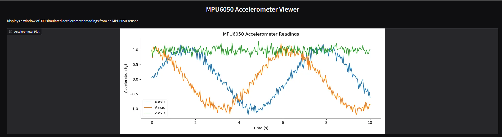

# Fall-Detector-ESP32
A prototype for a ML-based fall detectoring using MPU3060 IMU and ESP32

## MQTT Communication

Using MQTT protocol of communication, accelerometer coordinates are streamed from the device to desktop based interface.

## Desktop-based interface

Grad.io interface for prototyping and visualizing the streamed data

